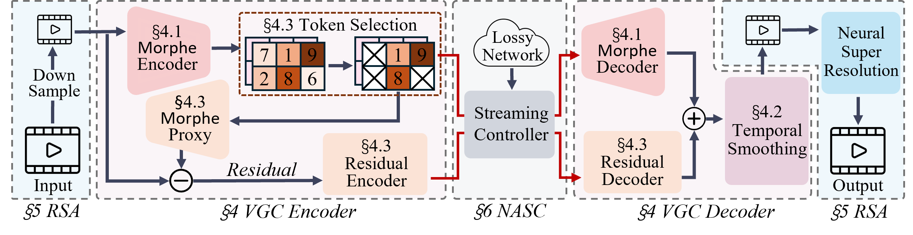

## ***Morphe***: High-Fidelity Generative Video Streaming with Vision Foundation Model

 
 

⭐ If ***Morphe*** is helpful to you, please star this repo. Thanks! 🤗
 
## ✅ TODO
- [ ] Update paper link
- [ ] Pretrained models
- [ ] Code release
- [x] ~~Repo release~~
- [x] ~~Demo~~

## 📝 Abstract

Video streaming is a fundamental Internet service, while the quality still cannot be guaranteed especially in poor network conditions such as bandwidth-constrained and remote areas. Existing works mainly work towards two directions: traditional pixel-codec streaming nearly approaches its limit and is hard to step further in compression; the emerging neural-enhanced or generative streaming usually fall short in latency and visual fidelity, hindering their practical deployment. 

Inspired by the recent success of vision foundation model (VFM), we strive to ***harness the powerful video understanding and processing capacities of VFM to achieve generalization, high fidelity and loss resilience for real-time video streaming with even higher compression rate.*** We present , the first revolutionized paradigm that enables VFM-based end-to-end generative video streaming towards this goal. Specifically, ***Morphe*** employs joint training of visual tokenizers and variable-resolution spatiotemporal optimization under simulated network constraints. Additionally, a robust streaming system is constructed that leverages intelligent packet dropping to resist real-world network perturbations. Extensive evaluation demonstrates that ***Morphe*** achieves comparable visual quality while saving 62.5% bandwidth compared to H.265, and accomplishes real-time, loss-resilient video delivery in challenging network environments, representing a milestone in VFM-enabled multimedia streaming solutions.

## 😍 Visual Demo

Visual comparison between ***Morphe*** and H.265 when compressing 1080P HD video at 395kbps with 20% packet loss:

  
    

    

 

    

## 📌Frame Demo

